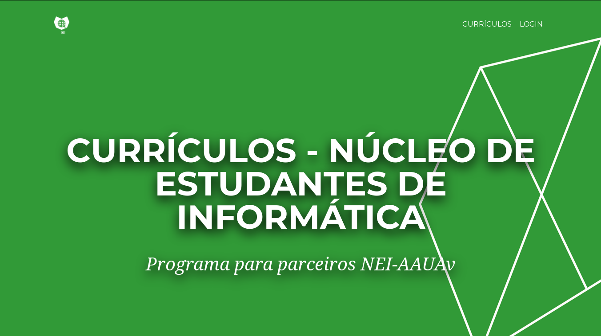

# NEI CV Dashboard

Núcleo de Estudantes de Informática da Universidade de Aveiro cv dashboard 1.0.

## Preview

## Download and Installation

To begin using this template, choose one of the following options to get started:
* Clone the repo: `git clone https://github.com/WebCDC/NEIEmpresas`
* [Fork, Clone, or Download on GitHub](https://github.com/WebCDC/NEIEmpresas)

## Authors
* [Rui Coelho](https://github.com/user-cube)

## Usage

### Basic Usage

After downloading, simply edit the HTML and CSS files included with the template in your favorite text editor to make changes. These are the only files you need to worry about, you can ignore everything else! To preview the changes you make to the code, you can open the `index.php` file in your web browser.
